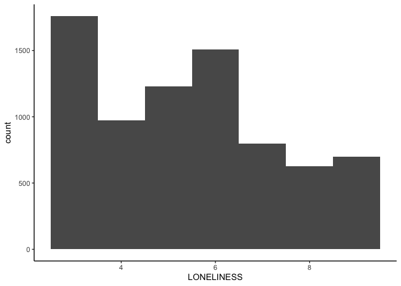

My Project
================
Jordan Starenky
2024-10-10

``` r
library(car)
```

    ## Loading required package: carData

``` r
library(dplyr)
```

    ## 
    ## Attaching package: 'dplyr'

    ## The following object is masked from 'package:car':
    ## 
    ##     recode

    ## The following objects are masked from 'package:stats':
    ## 
    ##     filter, lag

    ## The following objects are masked from 'package:base':
    ## 
    ##     intersect, setdiff, setequal, union

``` r
library(tidyr)
library(ggplot2)
library(psych)
```

    ## 
    ## Attaching package: 'psych'

    ## The following objects are masked from 'package:ggplot2':
    ## 
    ##     %+%, alpha

    ## The following object is masked from 'package:car':
    ## 
    ##     logit

``` r
library(haven)
library(Rmisc)
```

    ## Loading required package: lattice

    ## Loading required package: plyr

    ## ------------------------------------------------------------------------------

    ## You have loaded plyr after dplyr - this is likely to cause problems.
    ## If you need functions from both plyr and dplyr, please load plyr first, then dplyr:
    ## library(plyr); library(dplyr)

    ## ------------------------------------------------------------------------------

    ## 
    ## Attaching package: 'plyr'

    ## The following objects are masked from 'package:dplyr':
    ## 
    ##     arrange, count, desc, failwith, id, mutate, rename, summarise,
    ##     summarize

``` r
library(rstatix)
```

    ## 
    ## Attaching package: 'rstatix'

    ## The following objects are masked from 'package:plyr':
    ## 
    ##     desc, mutate

    ## The following object is masked from 'package:stats':
    ## 
    ##     filter

``` r
library(emmeans)
```

    ## Welcome to emmeans.
    ## Caution: You lose important information if you filter this package's results.
    ## See '? untidy'

``` r
library(bruceR)
```

    ## 
    ## bruceR (v2024.6)
    ## Broadly Useful Convenient and Efficient R functions
    ## 
    ## Packages also loaded:
    ## ✔ data.table ✔ emmeans
    ## ✔ dplyr      ✔ lmerTest
    ## ✔ tidyr      ✔ effectsize
    ## ✔ stringr    ✔ performance
    ## ✔ ggplot2    ✔ interactions
    ## 
    ## Main functions of `bruceR`:
    ## cc()             Describe()  TTEST()
    ## add()            Freq()      MANOVA()
    ## .mean()          Corr()      EMMEANS()
    ## set.wd()         Alpha()     PROCESS()
    ## import()         EFA()       model_summary()
    ## print_table()    CFA()       lavaan_summary()
    ## 
    ## For full functionality, please install all dependencies:
    ## install.packages("bruceR", dep=TRUE)
    ## 
    ## Online documentation:
    ## https://psychbruce.github.io/bruceR
    ## 
    ## To use this package in publications, please cite:
    ## Bao, H.-W.-S. (2024). bruceR: Broadly useful convenient and efficient R functions (Version 2024.6) [Computer software]. https://CRAN.R-project.org/package=bruceR

    ## 
    ## These packages are dependencies of `bruceR` but not installed:
    ## - pacman, openxlsx, ggtext, lmtest, vars, phia, MuMIn, GGally
    ## 
    ## ***** Install all dependencies *****
    ## install.packages("bruceR", dep=TRUE)

``` r
library(dplyr)
library(labelled)


# Set working directory
setwd("/Users/jostarenky/Documents/GitHub/PSY329-Project")

# Read the TSV file
data <- read.table("/Users/jostarenky/Downloads/ICPSR_38964\ 2/DS0001/38964-0001-Data.tsv", sep = "\t", header = TRUE, fill = TRUE, quote = "")

# Write the data to a CSV file
write.csv(data, "38964-0001-Data.csv", row.names = FALSE)

#open file
data <- read.csv("/Users/jostarenky/Documents/GitHub/PSY329-Project/38964-0001-Data.csv")

#filter for desired variables
filtered_dataset <- data %>%
  select(SEX, MARSTAT, LONELY_A, LONELY_B, LONELY_C, HAPPY)
```

\#Clean Data

``` r
filtered_dataset <- filtered_dataset %>% filter(LONELY_A != "99", LONELY_B != "99", LONELY_C != "99")
filtered_dataset <- filtered_dataset %>% filter(SEX != "3")
filtered_dataset <- filtered_dataset %>% filter(MARSTAT != "99")
```

\#Recode Variables

``` r
filtered_dataset <- filtered_dataset%>%
  mutate_at(c('SEX'),funs(str_replace(., "1", "Male")))
```

    ## Warning: `funs()` was deprecated in dplyr 0.8.0.
    ## ℹ Please use a list of either functions or lambdas:
    ## 
    ## # Simple named list: list(mean = mean, median = median)
    ## 
    ## # Auto named with `tibble::lst()`: tibble::lst(mean, median)
    ## 
    ## # Using lambdas list(~ mean(., trim = .2), ~ median(., na.rm = TRUE))
    ## Call `lifecycle::last_lifecycle_warnings()` to see where this warning was
    ## generated.

``` r
filtered_dataset <- filtered_dataset%>%
  mutate_at(c('SEX'),funs(str_replace(., "2", "Female")))
```

    ## Warning: `funs()` was deprecated in dplyr 0.8.0.
    ## ℹ Please use a list of either functions or lambdas:
    ## 
    ## # Simple named list: list(mean = mean, median = median)
    ## 
    ## # Auto named with `tibble::lst()`: tibble::lst(mean, median)
    ## 
    ## # Using lambdas list(~ mean(., trim = .2), ~ median(., na.rm = TRUE))
    ## Call `lifecycle::last_lifecycle_warnings()` to see where this warning was
    ## generated.

``` r
filtered_dataset <- filtered_dataset%>%
  mutate_at(c('MARSTAT'),funs(str_replace(., "1", "Partnered")))
```

    ## Warning: `funs()` was deprecated in dplyr 0.8.0.
    ## ℹ Please use a list of either functions or lambdas:
    ## 
    ## # Simple named list: list(mean = mean, median = median)
    ## 
    ## # Auto named with `tibble::lst()`: tibble::lst(mean, median)
    ## 
    ## # Using lambdas list(~ mean(., trim = .2), ~ median(., na.rm = TRUE))
    ## Call `lifecycle::last_lifecycle_warnings()` to see where this warning was
    ## generated.

``` r
filtered_dataset <- filtered_dataset%>%
  mutate_at(c('MARSTAT'),funs(str_replace(., "2", "Single")))
```

    ## Warning: `funs()` was deprecated in dplyr 0.8.0.
    ## ℹ Please use a list of either functions or lambdas:
    ## 
    ## # Simple named list: list(mean = mean, median = median)
    ## 
    ## # Auto named with `tibble::lst()`: tibble::lst(mean, median)
    ## 
    ## # Using lambdas list(~ mean(., trim = .2), ~ median(., na.rm = TRUE))
    ## Call `lifecycle::last_lifecycle_warnings()` to see where this warning was
    ## generated.

``` r
filtered_dataset <- filtered_dataset%>%
  mutate_at(c('MARSTAT'),funs(str_replace(., "3", "Single")))
```

    ## Warning: `funs()` was deprecated in dplyr 0.8.0.
    ## ℹ Please use a list of either functions or lambdas:
    ## 
    ## # Simple named list: list(mean = mean, median = median)
    ## 
    ## # Auto named with `tibble::lst()`: tibble::lst(mean, median)
    ## 
    ## # Using lambdas list(~ mean(., trim = .2), ~ median(., na.rm = TRUE))
    ## Call `lifecycle::last_lifecycle_warnings()` to see where this warning was
    ## generated.

``` r
filtered_dataset <- filtered_dataset%>%
  mutate_at(c('MARSTAT'),funs(str_replace(., "4", "Single")))
```

    ## Warning: `funs()` was deprecated in dplyr 0.8.0.
    ## ℹ Please use a list of either functions or lambdas:
    ## 
    ## # Simple named list: list(mean = mean, median = median)
    ## 
    ## # Auto named with `tibble::lst()`: tibble::lst(mean, median)
    ## 
    ## # Using lambdas list(~ mean(., trim = .2), ~ median(., na.rm = TRUE))
    ## Call `lifecycle::last_lifecycle_warnings()` to see where this warning was
    ## generated.

``` r
filtered_dataset <- filtered_dataset%>%
  mutate_at(c('MARSTAT'),funs(str_replace(., "5", "Single")))
```

    ## Warning: `funs()` was deprecated in dplyr 0.8.0.
    ## ℹ Please use a list of either functions or lambdas:
    ## 
    ## # Simple named list: list(mean = mean, median = median)
    ## 
    ## # Auto named with `tibble::lst()`: tibble::lst(mean, median)
    ## 
    ## # Using lambdas list(~ mean(., trim = .2), ~ median(., na.rm = TRUE))
    ## Call `lifecycle::last_lifecycle_warnings()` to see where this warning was
    ## generated.

``` r
filtered_dataset <- filtered_dataset%>%
  mutate_at(c('MARSTAT'),funs(str_replace(., "6", "Partnered")))
```

    ## Warning: `funs()` was deprecated in dplyr 0.8.0.
    ## ℹ Please use a list of either functions or lambdas:
    ## 
    ## # Simple named list: list(mean = mean, median = median)
    ## 
    ## # Auto named with `tibble::lst()`: tibble::lst(mean, median)
    ## 
    ## # Using lambdas list(~ mean(., trim = .2), ~ median(., na.rm = TRUE))
    ## Call `lifecycle::last_lifecycle_warnings()` to see where this warning was
    ## generated.

``` r
filtered_dataset <- filtered_dataset %>%
  mutate(LONELINESS = rowSums(cbind(LONELY_A, LONELY_B, LONELY_C)))
```

\#Normality

``` r
ggplot(filtered_dataset, aes(x = LONELINESS)) + geom_histogram(binwidth = 1) + theme_classic()
```

<!-- -->

``` r
ggplot(filtered_dataset, aes(x = LONELINESS)) + geom_density(adjust = 2)  + theme_classic()
```

<!-- -->

``` r
qq<-ggplot(filtered_dataset, aes(sample = LONELINESS)) + geom_qq()  + theme_classic()

qq+ geom_qq_line()
```

<!-- -->

``` r
describe(filtered_dataset$LONELINESS)
```

    ##    vars    n mean   sd median trimmed  mad min max range skew kurtosis   se
    ## X1    1 7594 5.43 1.92      5     5.3 2.97   3   9     6 0.32    -0.97 0.02

``` r
#normal

describeBy(LONELINESS ~ SEX, data = filtered_dataset)
```

    ## 
    ##  Descriptive statistics by group 
    ## SEX: Female
    ##            vars    n mean   sd median trimmed  mad min max range skew kurtosis
    ## LONELINESS    1 3948 5.56 1.89      6    5.46 2.97   3   9     6 0.24    -0.96
    ##              se
    ## LONELINESS 0.03
    ## ------------------------------------------------------------ 
    ## SEX: Male
    ##            vars    n mean   sd median trimmed  mad min max range skew kurtosis
    ## LONELINESS    1 3646  5.3 1.95      5    5.13 2.97   3   9     6 0.42    -0.95
    ##              se
    ## LONELINESS 0.03

``` r
describeBy(LONELINESS ~ MARSTAT, data = filtered_dataset)
```

    ## 
    ##  Descriptive statistics by group 
    ## MARSTAT: Partnered
    ##            vars    n mean   sd median trimmed  mad min max range skew kurtosis
    ## LONELINESS    1 3643 4.91 1.76      5    4.71 1.48   3   9     6 0.61    -0.56
    ##              se
    ## LONELINESS 0.03
    ## ------------------------------------------------------------ 
    ## MARSTAT: Single
    ##            vars    n mean   sd median trimmed  mad min max range skew kurtosis
    ## LONELINESS    1 3951 5.91 1.94      6    5.89 2.97   3   9     6 0.05    -1.07
    ##              se
    ## LONELINESS 0.03

``` r
#Variance
filtered_dataset%>%
  group_by(SEX) %>%
  summarize(variance = var(LONELINESS))
```

    ##   variance
    ## 1 3.700368

``` r
filtered_dataset%>%
  group_by(MARSTAT) %>%
  summarize(variance = var(LONELINESS))
```

    ##   variance
    ## 1 3.700368

``` r
leveneTest(LONELINESS~MARSTAT, filtered_dataset)
```

    ## Warning in leveneTest.default(y = y, group = group, ...): group coerced to
    ## factor.

    ## Levene's Test for Homogeneity of Variance (center = median)
    ##         Df F value    Pr(>F)    
    ## group    1  29.883 4.736e-08 ***
    ##       7592                      
    ## ---
    ## Signif. codes:  0 '***' 0.001 '**' 0.01 '*' 0.05 '.' 0.1 ' ' 1

``` r
MANOVA(filtered_dataset, dv = "LONELINESS", between = "MARSTAT")
```

    ## 
    ## ====== ANOVA (Between-Subjects Design) ======
    ## 
    ## Descriptives:
    ## ─────────────────────────────
    ##  "MARSTAT"  Mean    S.D.    n
    ## ─────────────────────────────
    ##  Partnered 4.907 (1.759) 3643
    ##  Single    5.915 (1.943) 3951
    ## ─────────────────────────────
    ## Total sample size: N = 7594
    ## 
    ## ANOVA Table:
    ## Dependent variable(s):      LONELINESS
    ## Between-subjects factor(s): MARSTAT
    ## Within-subjects factor(s):  –
    ## Covariate(s):               –
    ## ───────────────────────────────────────────────────────────────────────────
    ##                MS   MSE df1  df2       F     p     η²p [90% CI of η²p]  η²G
    ## ───────────────────────────────────────────────────────────────────────────
    ## MARSTAT  1924.827 3.447   1 7592 558.354 <.001 ***   .069 [.060, .078] .069
    ## ───────────────────────────────────────────────────────────────────────────
    ## MSE = mean square error (the residual variance of the linear model)
    ## η²p = partial eta-squared = SS / (SS + SSE) = F * df1 / (F * df1 + df2)
    ## ω²p = partial omega-squared = (F - 1) * df1 / (F * df1 + df2 + 1)
    ## η²G = generalized eta-squared (see Olejnik & Algina, 2003)
    ## Cohen’s f² = η²p / (1 - η²p)
    ## 
    ## Levene’s Test for Homogeneity of Variance:
    ## ─────────────────────────────────────────────
    ##                 Levene’s F df1  df2     p    
    ## ─────────────────────────────────────────────
    ## DV: LONELINESS      34.565   1 7592 <.001 ***
    ## ─────────────────────────────────────────────

``` r
leveneTest(LONELINESS~SEX, filtered_dataset)
```

    ## Warning in leveneTest.default(y = y, group = group, ...): group coerced to
    ## factor.

    ## Levene's Test for Homogeneity of Variance (center = median)
    ##         Df F value  Pr(>F)  
    ## group    1  3.4769 0.06227 .
    ##       7592                  
    ## ---
    ## Signif. codes:  0 '***' 0.001 '**' 0.01 '*' 0.05 '.' 0.1 ' ' 1

``` r
MANOVA(filtered_dataset, dv = "LONELINESS", between = "SEX")
```

    ## 
    ## ====== ANOVA (Between-Subjects Design) ======
    ## 
    ## Descriptives:
    ## ──────────────────────────
    ##   "SEX"  Mean    S.D.    n
    ## ──────────────────────────
    ##  Female 5.557 (1.890) 3948
    ##  Male   5.296 (1.950) 3646
    ## ──────────────────────────
    ## Total sample size: N = 7594
    ## 
    ## ANOVA Table:
    ## Dependent variable(s):      LONELINESS
    ## Between-subjects factor(s): SEX
    ## Within-subjects factor(s):  –
    ## Covariate(s):               –
    ## ─────────────────────────────────────────────────────────────────────
    ##           MS   MSE df1  df2      F     p     η²p [90% CI of η²p]  η²G
    ## ─────────────────────────────────────────────────────────────────────
    ## SEX  128.922 3.684   1 7592 34.996 <.001 ***   .005 [.002, .007] .005
    ## ─────────────────────────────────────────────────────────────────────
    ## MSE = mean square error (the residual variance of the linear model)
    ## η²p = partial eta-squared = SS / (SS + SSE) = F * df1 / (F * df1 + df2)
    ## ω²p = partial omega-squared = (F - 1) * df1 / (F * df1 + df2 + 1)
    ## η²G = generalized eta-squared (see Olejnik & Algina, 2003)
    ## Cohen’s f² = η²p / (1 - η²p)
    ## 
    ## Levene’s Test for Homogeneity of Variance:
    ## ─────────────────────────────────────────────
    ##                 Levene’s F df1  df2     p    
    ## ─────────────────────────────────────────────
    ## DV: LONELINESS       9.843   1 7592  .002 ** 
    ## ─────────────────────────────────────────────

``` r
filtered_dataset$Group <- ifelse(filtered_dataset$SEX == "Female" & filtered_dataset$MARSTAT == "Single", "Single Women", 
                     ifelse(filtered_dataset$SEX == "Male" & filtered_dataset$MARSTAT == "Single", "Single Men", 
                            ifelse(filtered_dataset$SEX == "Female" & filtered_dataset$MARSTAT == "Partnered", "Partnered Women", 
                                   "Partnered Men")))
```

``` r
mod<-MANOVA(filtered_dataset, dv = "LONELINESS", between = c("SEX", "MARSTAT")) 
```

    ## 
    ## ====== ANOVA (Between-Subjects Design) ======
    ## 
    ## Descriptives:
    ## ────────────────────────────────────
    ##   "SEX" "MARSTAT"  Mean    S.D.    n
    ## ────────────────────────────────────
    ##  Female Partnered 5.180 (1.768) 1880
    ##  Female Single    5.899 (1.932) 2068
    ##  Male   Partnered 4.616 (1.701) 1763
    ##  Male   Single    5.933 (1.955) 1883
    ## ────────────────────────────────────
    ## Total sample size: N = 7594
    ## 
    ## ANOVA Table:
    ## Dependent variable(s):      LONELINESS
    ## Between-subjects factor(s): SEX, MARSTAT
    ## Within-subjects factor(s):  –
    ## Covariate(s):               –
    ## ─────────────────────────────────────────────────────────────────────────────────
    ##                      MS   MSE df1  df2       F     p     η²p [90% CI of η²p]  η²G
    ## ─────────────────────────────────────────────────────────────────────────────────
    ## SEX             133.245 3.410   1 7590  39.076 <.001 ***   .005 [.003, .008] .005
    ## MARSTAT        1959.517 3.410   1 7590 574.654 <.001 ***   .070 [.061, .080] .070
    ## SEX * MARSTAT   169.147 3.410   1 7590  49.604 <.001 ***   .006 [.004, .010] .006
    ## ─────────────────────────────────────────────────────────────────────────────────
    ## MSE = mean square error (the residual variance of the linear model)
    ## η²p = partial eta-squared = SS / (SS + SSE) = F * df1 / (F * df1 + df2)
    ## ω²p = partial omega-squared = (F - 1) * df1 / (F * df1 + df2 + 1)
    ## η²G = generalized eta-squared (see Olejnik & Algina, 2003)
    ## Cohen’s f² = η²p / (1 - η²p)
    ## 
    ## Levene’s Test for Homogeneity of Variance:
    ## ─────────────────────────────────────────────
    ##                 Levene’s F df1  df2     p    
    ## ─────────────────────────────────────────────
    ## DV: LONELINESS      13.447   3 7590 <.001 ***
    ## ─────────────────────────────────────────────

``` r
EMMEANS(mod, effect = "SEX", by = "MARSTAT", p.adjust = "none")
```

    ## ------ EMMEANS (effect = "SEX") ------
    ## 
    ## Joint Tests of "SEX":
    ## ───────────────────────────────────────────────────────────────
    ##  Effect "MARSTAT" df1  df2      F     p     η²p [90% CI of η²p]
    ## ───────────────────────────────────────────────────────────────
    ##     SEX Partnered   1 7590 84.970 <.001 ***   .011 [.007, .015]
    ##     SEX Single      1 7590  0.327  .568       .000 [.000, .001]
    ## ───────────────────────────────────────────────────────────────
    ## Note. Simple effects of repeated measures with 3 or more levels
    ## are different from the results obtained with SPSS MANOVA syntax.
    ## 
    ## Estimated Marginal Means of "SEX":
    ## ───────────────────────────────────────────────
    ##   "SEX" "MARSTAT" Mean [95% CI of Mean]    S.E.
    ## ───────────────────────────────────────────────
    ##  Female Partnered  5.180 [5.097, 5.264] (0.043)
    ##  Male   Partnered  4.616 [4.530, 4.702] (0.044)
    ##  Female Single     5.899 [5.819, 5.979] (0.041)
    ##  Male   Single     5.933 [5.849, 6.016] (0.043)
    ## ───────────────────────────────────────────────
    ## 
    ## Pairwise Comparisons of "SEX":
    ## ───────────────────────────────────────────────────────────────────────────────────────
    ##       Contrast "MARSTAT" Estimate    S.E.   df      t     p     Cohen’s d [95% CI of d]
    ## ───────────────────────────────────────────────────────────────────────────────────────
    ##  Male - Female Partnered   -0.564 (0.061) 7590 -9.218 <.001 *** -0.306 [-0.371, -0.241]
    ##  Male - Female Single       0.034 (0.059) 7590  0.572  .568      0.018 [-0.044,  0.081]
    ## ───────────────────────────────────────────────────────────────────────────────────────
    ## Pooled SD for computing Cohen’s d: 1.847
    ## 
    ## Disclaimer:
    ## By default, pooled SD is Root Mean Square Error (RMSE).
    ## There is much disagreement on how to compute Cohen’s d.
    ## You are completely responsible for setting `sd.pooled`.
    ## You might also use `effectsize::t_to_d()` to compute d.

``` r
EMMEANS(mod, effect = "MARSTAT", by = "SEX", p.adjust = "none")
```

    ## ------ EMMEANS (effect = "MARSTAT") ------
    ## 
    ## Joint Tests of "MARSTAT":
    ## ──────────────────────────────────────────────────────────────
    ##   Effect  "SEX" df1  df2       F     p     η²p [90% CI of η²p]
    ## ──────────────────────────────────────────────────────────────
    ##  MARSTAT Female   1 7590 149.136 <.001 ***   .019 [.014, .025]
    ##  MARSTAT Male     1 7590 462.832 <.001 ***   .057 [.049, .066]
    ## ──────────────────────────────────────────────────────────────
    ## Note. Simple effects of repeated measures with 3 or more levels
    ## are different from the results obtained with SPSS MANOVA syntax.
    ## 
    ## Estimated Marginal Means of "MARSTAT":
    ## ───────────────────────────────────────────────
    ##  "MARSTAT"  "SEX" Mean [95% CI of Mean]    S.E.
    ## ───────────────────────────────────────────────
    ##  Partnered Female  5.180 [5.097, 5.264] (0.043)
    ##  Single    Female  5.899 [5.819, 5.979] (0.041)
    ##  Partnered Male    4.616 [4.530, 4.702] (0.044)
    ##  Single    Male    5.933 [5.849, 6.016] (0.043)
    ## ───────────────────────────────────────────────
    ## 
    ## Pairwise Comparisons of "MARSTAT":
    ## ─────────────────────────────────────────────────────────────────────────────────────────
    ##            Contrast  "SEX" Estimate    S.E.   df      t     p     Cohen’s d [95% CI of d]
    ## ─────────────────────────────────────────────────────────────────────────────────────────
    ##  Single - Partnered Female    0.719 (0.059) 7590 12.212 <.001 ***    0.389 [0.327, 0.452]
    ##  Single - Partnered Male      1.317 (0.061) 7590 21.514 <.001 ***    0.713 [0.648, 0.778]
    ## ─────────────────────────────────────────────────────────────────────────────────────────
    ## Pooled SD for computing Cohen’s d: 1.847
    ## 
    ## Disclaimer:
    ## By default, pooled SD is Root Mean Square Error (RMSE).
    ## There is much disagreement on how to compute Cohen’s d.
    ## You are completely responsible for setting `sd.pooled`.
    ## You might also use `effectsize::t_to_d()` to compute d.

``` r
plot<-summarySE(filtered_dataset, measurevar="LONELINESS", groupvars=c("SEX", "MARSTAT"))

plot
```

    ##      SEX   MARSTAT    N LONELINESS       sd         se         ci
    ## 1 Female Partnered 1880   5.180319 1.768368 0.04078438 0.07998744
    ## 2 Female    Single 2068   5.898936 1.932318 0.04249163 0.08333087
    ## 3   Male Partnered 1763   4.615995 1.700809 0.04050694 0.07944672
    ## 4   Male    Single 1883   5.932554 1.954644 0.04504459 0.08834258

``` r
plot2<-summarySE(filtered_dataset, measurevar="LONELINESS", groupvars=c("Group"))

plot2
```

    ##             Group    N LONELINESS       sd         se         ci
    ## 1   Partnered Men 1763   4.615995 1.700809 0.04050694 0.07944672
    ## 2 Partnered Women 1880   5.180319 1.768368 0.04078438 0.07998744
    ## 3      Single Men 1883   5.932554 1.954644 0.04504459 0.08834258
    ## 4    Single Women 2068   5.898936 1.932318 0.04249163 0.08333087

``` r
ggplot(plot, aes(x = SEX, y = LONELINESS, fill = SEX)) +
  geom_col() + facet_wrap(~ MARSTAT) + theme_bruce()
```

<!-- -->

``` r
ggplot(plot2, aes(x = Group, y = LONELINESS, fill = Group)) +
  geom_col()  + theme_bruce() + theme(axis.text.x = element_text(angle = -10))
```

<!-- -->

``` r
#Recoding happiness variable (was reverse coded)
filtered_dataset$HAPPY <- 5 - filtered_dataset$HAPPY
```

``` r
#checking assumptions for happiness
#normality plots
ggplot(filtered_dataset, aes(x = HAPPY)) + geom_histogram(binwidth = 1) + theme_classic()
```

<!-- -->

``` r
ggplot(filtered_dataset, aes(x = HAPPY)) + geom_density(adjust = 2)  + theme_classic()
```

<!-- -->

``` r
qq<-ggplot(filtered_dataset, aes(sample = HAPPY)) + geom_qq()  + theme_classic()

qq+ geom_qq_line()
```

<!-- -->

``` r
#normality tests
describe(filtered_dataset$HAPPY)
```

    ##    vars    n mean   sd median trimmed mad min max range  skew kurtosis   se
    ## X1    1 7594 3.02 0.73      3    3.06   0   1   4     3 -0.45     0.06 0.01

``` r
#normal

describeBy(HAPPY ~ SEX, data = filtered_dataset)
```

    ## 
    ##  Descriptive statistics by group 
    ## SEX: Female
    ##       vars    n mean   sd median trimmed mad min max range  skew kurtosis   se
    ## HAPPY    1 3948    3 0.72      3    3.04   0   1   4     3 -0.45     0.18 0.01
    ## ------------------------------------------------------------ 
    ## SEX: Male
    ##       vars    n mean   sd median trimmed mad min max range  skew kurtosis   se
    ## HAPPY    1 3646 3.04 0.74      3    3.09   0   1   4     3 -0.45    -0.06 0.01

``` r
describeBy(HAPPY ~ MARSTAT, data = filtered_dataset)
```

    ## 
    ##  Descriptive statistics by group 
    ## MARSTAT: Partnered
    ##       vars    n mean   sd median trimmed mad min max range skew kurtosis   se
    ## HAPPY    1 3643 3.15 0.69      3    3.21   0   1   4     3 -0.5     0.14 0.01
    ## ------------------------------------------------------------ 
    ## MARSTAT: Single
    ##       vars    n mean   sd median trimmed mad min max range  skew kurtosis   se
    ## HAPPY    1 3951  2.9 0.74      3    2.93   0   1   4     3 -0.39     0.01 0.01

``` r
#variances
filtered_dataset%>%
  group_by(SEX) %>%
  summarize(variance = var(HAPPY))
```

    ##    variance
    ## 1 0.5324719

``` r
filtered_dataset%>%
  group_by(MARSTAT) %>%
  summarize(variance = var(HAPPY))
```

    ##    variance
    ## 1 0.5324719

``` r
mod<-MANOVA(filtered_dataset, dv = "HAPPY", between = c("SEX", "MARSTAT")) 
```

    ## 
    ## ====== ANOVA (Between-Subjects Design) ======
    ## 
    ## Descriptives:
    ## ────────────────────────────────────
    ##   "SEX" "MARSTAT"  Mean    S.D.    n
    ## ────────────────────────────────────
    ##  Female Partnered 3.099 (0.689) 1880
    ##  Female Single    2.918 (0.737) 2068
    ##  Male   Partnered 3.206 (0.697) 1763
    ##  Male   Single    2.890 (0.746) 1883
    ## ────────────────────────────────────
    ## Total sample size: N = 7594
    ## 
    ## ANOVA Table:
    ## Dependent variable(s):      HAPPY
    ## Between-subjects factor(s): SEX, MARSTAT
    ## Within-subjects factor(s):  –
    ## Covariate(s):               –
    ## ────────────────────────────────────────────────────────────────────────────────
    ##                     MS   MSE df1  df2       F     p     η²p [90% CI of η²p]  η²G
    ## ────────────────────────────────────────────────────────────────────────────────
    ## SEX              3.013 0.516   1 7590   5.839  .016 *     .001 [.000, .002] .001
    ## MARSTAT        117.111 0.516   1 7590 226.944 <.001 ***   .029 [.023, .036] .029
    ## SEX * MARSTAT    8.655 0.516   1 7590  16.772 <.001 ***   .002 [.001, .004] .002
    ## ────────────────────────────────────────────────────────────────────────────────
    ## MSE = mean square error (the residual variance of the linear model)
    ## η²p = partial eta-squared = SS / (SS + SSE) = F * df1 / (F * df1 + df2)
    ## ω²p = partial omega-squared = (F - 1) * df1 / (F * df1 + df2 + 1)
    ## η²G = generalized eta-squared (see Olejnik & Algina, 2003)
    ## Cohen’s f² = η²p / (1 - η²p)
    ## 
    ## Levene’s Test for Homogeneity of Variance:
    ## ────────────────────────────────────────
    ##            Levene’s F df1  df2     p    
    ## ────────────────────────────────────────
    ## DV: HAPPY       7.437   3 7590 <.001 ***
    ## ────────────────────────────────────────

``` r
EMMEANS(mod, effect = "SEX", by = "MARSTAT", p.adjust = "none")
```

    ## ------ EMMEANS (effect = "SEX") ------
    ## 
    ## Joint Tests of "SEX":
    ## ───────────────────────────────────────────────────────────────
    ##  Effect "MARSTAT" df1  df2      F     p     η²p [90% CI of η²p]
    ## ───────────────────────────────────────────────────────────────
    ##     SEX Partnered   1 7590 20.386 <.001 ***   .003 [.001, .005]
    ##     SEX Single      1 7590  1.468  .226       .000 [.000, .001]
    ## ───────────────────────────────────────────────────────────────
    ## Note. Simple effects of repeated measures with 3 or more levels
    ## are different from the results obtained with SPSS MANOVA syntax.
    ## 
    ## Estimated Marginal Means of "SEX":
    ## ───────────────────────────────────────────────
    ##   "SEX" "MARSTAT" Mean [95% CI of Mean]    S.E.
    ## ───────────────────────────────────────────────
    ##  Female Partnered  3.099 [3.066, 3.131] (0.017)
    ##  Male   Partnered  3.206 [3.173, 3.240] (0.017)
    ##  Female Single     2.918 [2.887, 2.949] (0.016)
    ##  Male   Single     2.890 [2.858, 2.923] (0.017)
    ## ───────────────────────────────────────────────
    ## 
    ## Pairwise Comparisons of "SEX":
    ## ───────────────────────────────────────────────────────────────────────────────────────
    ##       Contrast "MARSTAT" Estimate    S.E.   df      t     p     Cohen’s d [95% CI of d]
    ## ───────────────────────────────────────────────────────────────────────────────────────
    ##  Male - Female Partnered    0.108 (0.024) 7590  4.515 <.001 ***   0.150 [ 0.085, 0.215]
    ##  Male - Female Single      -0.028 (0.023) 7590 -1.212  .226      -0.039 [-0.101, 0.024]
    ## ───────────────────────────────────────────────────────────────────────────────────────
    ## Pooled SD for computing Cohen’s d: 0.718
    ## 
    ## Disclaimer:
    ## By default, pooled SD is Root Mean Square Error (RMSE).
    ## There is much disagreement on how to compute Cohen’s d.
    ## You are completely responsible for setting `sd.pooled`.
    ## You might also use `effectsize::t_to_d()` to compute d.

``` r
EMMEANS(mod, effect = "MARSTAT", by = "SEX", p.adjust = "none")
```

    ## ------ EMMEANS (effect = "MARSTAT") ------
    ## 
    ## Joint Tests of "MARSTAT":
    ## ──────────────────────────────────────────────────────────────
    ##   Effect  "SEX" df1  df2       F     p     η²p [90% CI of η²p]
    ## ──────────────────────────────────────────────────────────────
    ##  MARSTAT Female   1 7590  62.616 <.001 ***   .008 [.005, .012]
    ##  MARSTAT Male     1 7590 176.633 <.001 ***   .023 [.018, .029]
    ## ──────────────────────────────────────────────────────────────
    ## Note. Simple effects of repeated measures with 3 or more levels
    ## are different from the results obtained with SPSS MANOVA syntax.
    ## 
    ## Estimated Marginal Means of "MARSTAT":
    ## ───────────────────────────────────────────────
    ##  "MARSTAT"  "SEX" Mean [95% CI of Mean]    S.E.
    ## ───────────────────────────────────────────────
    ##  Partnered Female  3.099 [3.066, 3.131] (0.017)
    ##  Single    Female  2.918 [2.887, 2.949] (0.016)
    ##  Partnered Male    3.206 [3.173, 3.240] (0.017)
    ##  Single    Male    2.890 [2.858, 2.923] (0.017)
    ## ───────────────────────────────────────────────
    ## 
    ## Pairwise Comparisons of "MARSTAT":
    ## ──────────────────────────────────────────────────────────────────────────────────────────
    ##            Contrast  "SEX" Estimate    S.E.   df       t     p     Cohen’s d [95% CI of d]
    ## ──────────────────────────────────────────────────────────────────────────────────────────
    ##  Single - Partnered Female   -0.181 (0.023) 7590  -7.913 <.001 *** -0.252 [-0.315, -0.190]
    ##  Single - Partnered Male     -0.316 (0.024) 7590 -13.290 <.001 *** -0.440 [-0.505, -0.375]
    ## ──────────────────────────────────────────────────────────────────────────────────────────
    ## Pooled SD for computing Cohen’s d: 0.718
    ## 
    ## Disclaimer:
    ## By default, pooled SD is Root Mean Square Error (RMSE).
    ## There is much disagreement on how to compute Cohen’s d.
    ## You are completely responsible for setting `sd.pooled`.
    ## You might also use `effectsize::t_to_d()` to compute d.

``` r
plot<-summarySE(filtered_dataset, measurevar="HAPPY", groupvars=c("SEX", "MARSTAT"))

plot
```

    ##      SEX   MARSTAT    N    HAPPY        sd         se         ci
    ## 1 Female Partnered 1880 3.098936 0.6888444 0.01588701 0.03115804
    ## 2 Female    Single 2068 2.917795 0.7367685 0.01620152 0.03177300
    ## 3   Male Partnered 1763 3.206466 0.6965320 0.01658880 0.03253580
    ## 4   Male    Single 1883 2.890069 0.7463138 0.01719873 0.03373058

``` r
plot2<-summarySE(filtered_dataset, measurevar="HAPPY", groupvars=c("Group"))

plot2
```

    ##             Group    N    HAPPY        sd         se         ci
    ## 1   Partnered Men 1763 3.206466 0.6965320 0.01658880 0.03253580
    ## 2 Partnered Women 1880 3.098936 0.6888444 0.01588701 0.03115804
    ## 3      Single Men 1883 2.890069 0.7463138 0.01719873 0.03373058
    ## 4    Single Women 2068 2.917795 0.7367685 0.01620152 0.03177300

``` r
ggplot(plot, aes(x = SEX, y = HAPPY, fill = SEX)) +
  geom_col() + facet_wrap(~ MARSTAT) + theme_bruce()
```

<!-- -->

``` r
ggplot(plot2, aes(x = Group, y = HAPPY, fill = Group)) +
  geom_col()  + theme_bruce() + theme(axis.text.x = element_text(angle = -10))
```

<!-- -->
